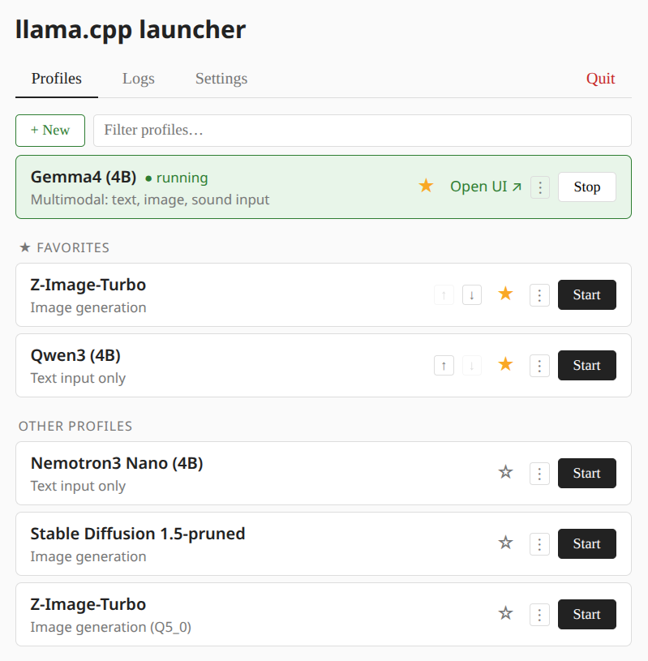

# llama-launcher

Web GUI for managing and launching [llama.cpp](https://github.com/ggml-org/llama.cpp) and [stable-diffusion.cpp](https://github.com/leejet/stable-diffusion.cpp) server profiles. Stdlib-only Python — no dependencies, no build step.



A **profile** is a saved set of CLI arguments for `llama-server` or `sd-server` — model path, context size, GPU layers, port, and anything else those binaries accept. llama-launcher stores each profile as a plain `.conf` file and provides a browser UI to start, stop, and switch between them without retyping flags each time.

## Requirements

- Python 3
- `llama-server` (from llama.cpp) and/or `sd-server` (from stable-diffusion.cpp)

Binaries needs to be on the PATH, or configured via Settings

## Running

```bash
python llama_gui.py
```

Opens `http://127.0.0.1:7777` in the browser automatically.

## Installing a shortcut

### Linux — `.desktop` entry

Create `~/.local/share/applications/llama-launcher.desktop`:

```ini
[Desktop Entry]
Name=llama.cpp Launcher
Comment=Web GUI for managing llama.cpp profiles
Exec=python /path/to/llama_gui.py
Icon=/path/to/llama-icon.svg
Type=Application
Terminal=false
Categories=Utility;
```

Replace `/path/to/` with the actual directory where the files are located. The entry will appear in the application menu after saving.

### Windows — Start Menu shortcut

Run the following in **PowerShell** (no admin rights required):

```powershell
$ws  = New-Object -ComObject WScript.Shell
$lnk = $ws.CreateShortcut("$env:APPDATA\Microsoft\Windows\Start Menu\Programs\llama-launcher.lnk")
$lnk.TargetPath       = "pythonw.exe"
$lnk.Arguments        = '"C:\path\to\llama_gui.py"'
$lnk.WorkingDirectory = "C:\path\to"
$lnk.IconLocation     = "C:\path\to\llama-icon.ico"
$lnk.Description      = "Web GUI for managing llama.cpp profiles"
$lnk.Save()
```

Replace `C:\path\to` with the actual directory. `pythonw.exe` runs the launcher without a console window.

For a **Desktop shortcut** instead, change the `.lnk` path to:

```powershell
"$env:USERPROFILE\Desktop\llama-launcher.lnk"
```

## Profiles

`.conf` files in `~/.config/llama-launcher/profiles/`. Each file is a flat list of CLI arguments for the target binary, one per line. See `example.conf` for a template.

Meta comments at the top of the file control how the profile appears in the UI and which backend it uses:

```
# name: My Model
# description: Optional description shown under the name
# type: llama   # or: sd  (for stable-diffusion.cpp, defaults to llama)
```

The `type` key selects the backend: `llama` for `llama-server`, `sd` for `sd-server` (see [Configurable paths](#configurable-paths)).

## Configurable paths

All paths are set in **Settings** (or directly in `config.json`). Accepts a bare command name (looked up on PATH) or an absolute path; `~` is expanded.

| Setting | Default | Notes |
|---------|---------|-------|
| `llama_bin` | `llama-server` | llama.cpp backend |
| `sd_bin` | `sd-server` | stable-diffusion.cpp backend |
| `profiles_dir` | `~/.config/llama-launcher/profiles` | Where `.conf` files are stored; relative paths resolve next to the script |
| `models_dir` | *(empty)* | Base directory for model files; enables `./` shorthand in profiles (see below) |

### `./` path resolution in profiles

Arguments in a `.conf` file that start with `./` are resolved relative to `models_dir` when it is set. This allows writing portable profiles without repeating the full models path every time:

```
# models_dir = /data/models  (set in Settings)

--model ./mistral-7b.gguf     # → /data/models/mistral-7b.gguf
--mmproj ./mmproj.gguf        # → /data/models/mmproj.gguf
```

Arguments starting with `~` are always expanded to the home directory regardless of `models_dir`. Absolute paths are passed through unchanged.

## File locations

| File | Path |
|------|------|
| Profiles directory | `~/.config/llama-launcher/profiles/` |
| Config | `~/.config/llama-launcher/config.json` |
| State (favorites, last used) | `~/.config/llama-launcher/state.json` |
| Launcher log | `~/.local/share/llama-launcher/launcher.log` |

`$XDG_CONFIG_HOME` and `$XDG_DATA_HOME` are respected if set.

## Environment variables

| Variable | Default | Description |
|----------|---------|-------------|
| `XDG_CONFIG_HOME` | `~/.config` | Base directory for config, profiles, and state files |
| `XDG_DATA_HOME` | `~/.local/share` | Base directory for the launcher log |
| `LLAMA_LAUNCHER_ALLOW_REMOTE` | *(unset)* | Set to `1` to allow binding to non-loopback addresses and disable the DNS-rebinding / Host-header check. Required when exposing the launcher on a LAN or via a reverse proxy. |
| `LLAMA_LAUNCHER_TRUST_BINARIES` | *(unset)* | Set to `1` to skip the binary signature probe when saving `llama_bin` / `sd_bin` in Settings. Useful for custom-branded builds whose `--version` output does not contain the expected signature strings. |
